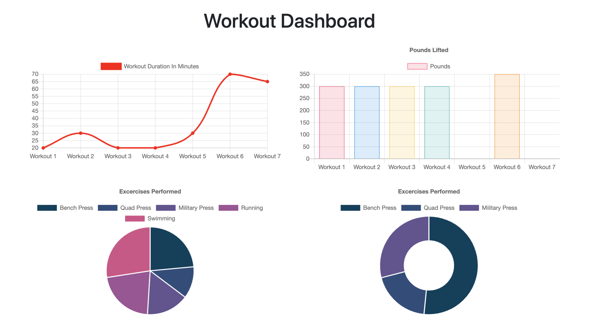

# WorkoutTracker
Keep track of your workouts

## Installation

Clone folder onto your own computer by forking the repository and using the "Clone or download" button on github.

Install all npm modules using the command "npm install".

Open up your MongoDB connection. 

You can pre-seed the database by running the command "npm run seed" in the root folder.

Run the server by calling "npm start" from the root folder. 

## Functionality
When first visiting the website, user's will create their first new workout. Workouts are stored as a series of exercises along with the date that the workout was created. After the first workout is initialized, users will have the option to start new workouts or to continue their previous workout. The last workout data will be shown on the main page, including information such as the date, total duration, number of exercises, and more. 

### Adding Exercises
Once users have selected a workout, they have the option of adding exercise data. They are given the option of selecting the type of exercise (resistance or cardio) as well as parameters that may be specific to the exercise type: name, duration, distance, weight, sets, and reps. 

User's can continue to add exercises to the workout using the "Add Exercise" button or to navigate off the workout page by hitting the "Complete button". 

### Workout Dashboard
User's can acces the dashboard using the navigation bar at the top of the homepage. The dashboard displays data from the last seven workouts. A graph of the total duration and total amount of weight used for each workout is displayed. For each graph, a pie chart displays the amount of time/weight for the specific types of exercises, compiled by name, over the course of the last 7 workouts. 

While the front-end javascript was provided, the stats.js was altered in the following ways: 

1. To make the data representations more accurate. Initially, the labels for the graph were days of the week. However, the labels were not matched up with the actual dates that the workouts occured and in some cases multiply workouts were done within a single day. 

2. The graph for total duration initially showed the separate durations of the first seven exercises. The javascript was altered to use the compile the durations of all exercises within a workout and to show the total duration for the latest seven workouts with workout 7 being the most recently completed workout. 

3. The piechart for durations was changed so that exercises with the same name where compiled together into one category instead of being displayed multiple times with the same label. It was also modified to include all exercises from the last 7 workouts instead of being limitied to the first seven exercises. 

4. The bar graph for pounds lifted was changed so that, similar to the total duration, the weights from all resistance exercises from a workout were added together and the total for the lastest seven workouts is displayed instead of the separate weights from the first seven exercises (whether they were resistance or cardio). 

5. The doughnut chart was modified similarily to the pie chart but excludes all cardio exercises, since they have no weight data. 

## Coding

This project utilizes javascript, node, express, mongoDB, and mongoose: 

1.   The front end was provided by triology and kept as is, except for the previously mentioned modifications to the stats.js file. 

2. The app runs on an express server, utilizing both html and api routes and is structured using MVC architecture.

3. The data from the app is stored in noSQL database, mongoDB. The database consists of a single collection (workouts). Each workout added by the user is stored as a document with the exercises pushed into an array of javascript objects. 

4. Models for each workout document are created using mongoose schema. A virtual is added to the schema to compile the total duration for each workout. 

5. API routes were created using mongoose to retreive, create, and update document data from the database.

## Meta 

Jamie Kook - kookjc6@gmail.com

Github Repo: 
[https://github.com/JamieKook/WorkoutTracker](https://github.com/JamieKook/WorkoutTracker)

Deployed App: 
[https://aqueous-earth-88625.herokuapp.com/](https://aqueous-earth-88625.herokuapp.com/)

